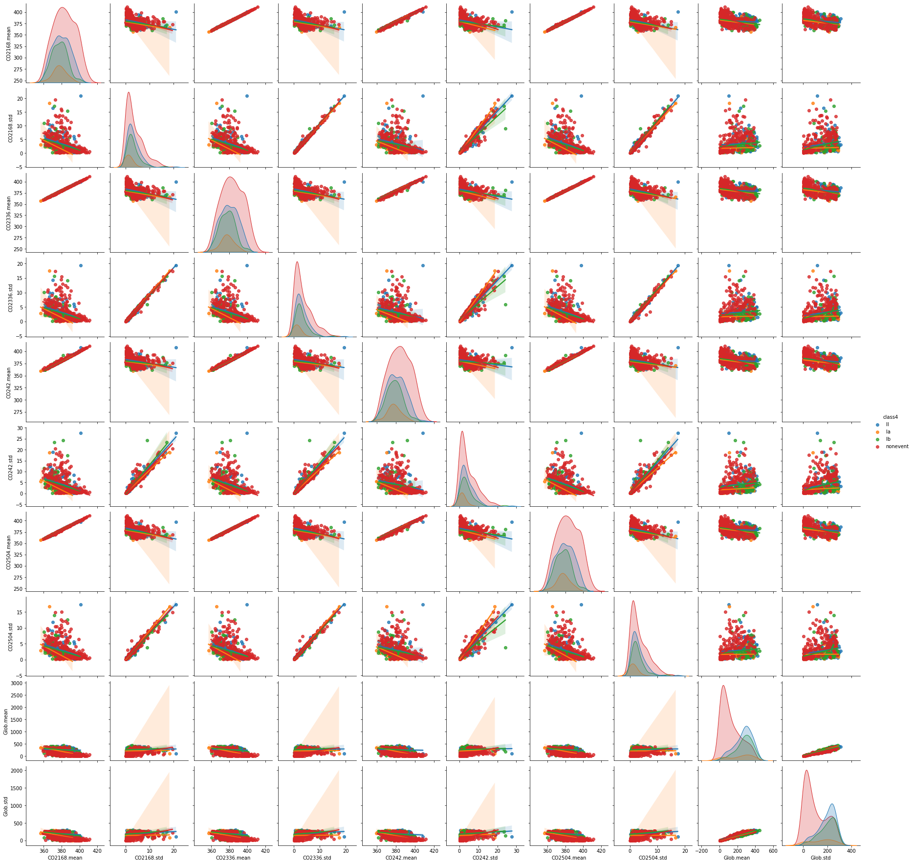
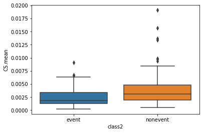
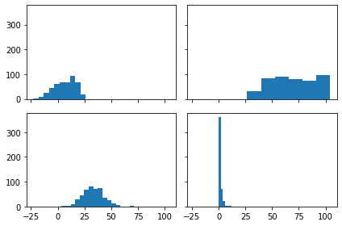
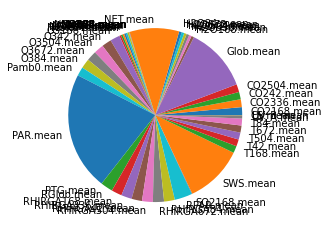
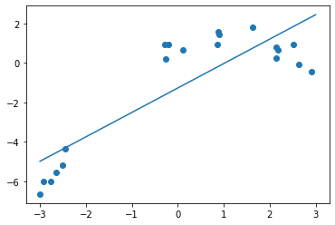
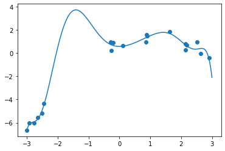
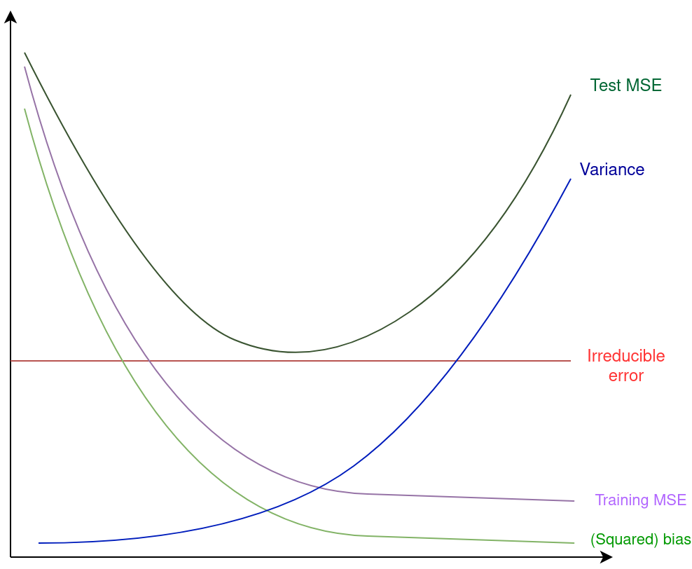
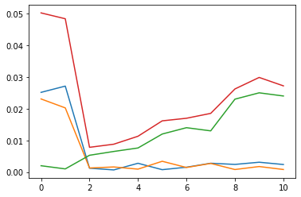

## Problem 1

### Task a and Task b

*Task a* and *Task b* are trivial, hence the code is not reported. After dataset loading, though, the dataframe I obtained has the following shape: `458 rows × 103 columns`.

### Task c

With regards to *Task c*, applying the `describe()` function gave a dataframe with shape equals to `8 rows x 101 columns`; the rows coincide with the typical description variables: `count`, `mean`, `std`, `min`, `25%`, `50%`, `75%`, `max`.

Then, I applied the function `pairplot` from seaborn library:
```python
sns.pairplot(npf, hue='class4', vars=npf.columns[2:12], kind='reg')
```
This returned the following result:

{width=400px}

Secondarily, I applied the function `boxplot` from seaborn library:
```python
sns.boxplot(x='class2', y='CS.mean', data=npf)
```
This returned the following result:

{width=280px}

Finally, I created a new qualitative variable as asked. The `describe` command reports a number of 458 *event days*, and the last boxplot function (`sns.boxplot(x='class2', y='CS.mean', data=npf)`) returns this output:

{width=280px}

Coming to the personal implementation of histograms, I used `matplotlib` to plot four histograms on quantitative variables with different number of bins. The following code
```python
fig, axs = plt.subplots(2, 2, sharey=True, sharex=True, tight_layout=True)
axs[0][0].hist(npf['T168.mean'], bins=10)
axs[0][1].hist(npf['RHIRGA672.mean'], bins=6)
axs[1][0].hist(npf['O3168.mean'], bins=16)
axs[1][1].hist(npf['NOx336.mean'], bins=6)
```

plots these four histograms:

{width=320px}

\newpage

Doing other _exploratory data analysis_ on the given dataset, I found out that many of the variables have little-to-no variance, while there are mainly four of them that have a huge variance in the dataset; these variables are:

- PAR
- NET
- GLOB
- SWS

This phenomenon can be seen also in the following pie chart:

{width=320px}

In order to obtain this pie chart, I used the following code:

```python
diff = []
labels = []
for i in npf:
    if(npf[i].dtype.name != 'category' and 'std' not in i):
        diff.append(npf[i].max() - npf[i].min())
        labels.append(i)

diff = diff[1:]
labels = labels[1:]
plt.pie(diff, labels=labels)
```

## Problem 2

### Task a

I used `numpy` and `pandas` in order to create the three sets; I used the following function in order to calculate them as requested (note: `np` stands for `numpy` and `pd` stands for `pandas`):

```python
def create_dataset(n):
    x = np.random.uniform(low=-3, high=3, size=n)
    eps = np.random.normal(loc=0, scale=0.4, size=n)
    y = []
    for i in range(0, len(x)):
        y.append((1+x[i]-(x[i]**2)/2) + eps[i])
    d = {'x':x,'y':y}
    return pd.DataFrame(d)
```

Then, I called the function for three times:
```python
training = create_dataset(20)
validation = create_dataset(20)
test = create_dataset(1000)
```

### Task b and Task c

I implemented from scratch linear regression functions; these are the following:

```python
def transform_x(x, degree):
    X = []
    for xi in x:
        row = [xi**d for d in range(0,degree+1)]
        X.append(row)
    return X

def ols(x, y, deg):
    X = np.matrix(transform_x(x, deg))
    betas = -np.matmul(
      np.matmul(np.linalg.inv(np.matmul(X.transpose(), X)), 
      X.transpose()), y
      )
    return betas

def f(x, betas):
    y = betas[0]
    for i in range(1,len(betas)):
        y+=betas[i]*(x**i)
    return -y
```

I then applied these functions with the following code:
```python
degrees = range(0,11)
for degree in degrees:
    betas = ols(training['x'], training['y'], degree)
    line_x = np.linspace(start=-3, stop=3, num=256)
    line_y = np.array([f(xi, betas) for xi in line_x])
    plt.scatter(training['x'], training['y'])
    plt.plot(line_x, line_y)
    plt.show()
```

Respectively, in the first code block the first function transforms the array x into the input matrix $\bold{X}$, used to fitting the polynomial (cfr. lecture slides). The function `ols` fits the polynomial given `x` the previous transformed matrix, `y` the targets vector and `deg` the degree of the polynomial. `f` then applies the function over a point `x`.
In the second code block these functions are applied, and at the same time data is plotted.

In order to calculate the MSE I used the following code:

```python
def calculate_mse(degree, betas, tr):
    pred = []
    for i in range(0, len(tr)):
        pred.append(f(tr['x'][i], betas))
    mse = np.sum((tr['y']-pred)**2)
    mse/=len(tr)
    return mse

mses = []
for degree in degrees:
    betas = ols(training['x'], training['y'], deg=degree)
    mses.append(calculate_mse(degree, betas, training))
```

This code calculates the MSE with the function `calculate_mse` for every degree from 0 to 10. I applied the same code for Task c, just substituting `training` variable with `validation` and `test`.

I'm not reporting every graph due to brevity, but these are the two graphs for, respectively, degree=1 and degree=10 on the training set.

{width=300px}
{width=300px}

The MSE results are reported at the end of this exercise's section.

### Task d and Task e

In order to calculate the cross-validation loss I used the following code:

```python
from copy import deepcopy

tv_combined = training.append(validation).reset_index()

def cv_split(tosplit, folds):
    split = []
    copy = deepcopy(tosplit).to_numpy()
    for i in range(0, folds):
        t = []
        while len(t) < int(len(tosplit) / folds):
            toremove = np.random.randint(0, len(copy))
            t.append([copy[toremove][1], copy[toremove][2]])
            copy = np.delete(copy, toremove, 0)
        split.append(t)
    return split

splits = cv_split(tv_combined, 10)
for degree in range(0,10):
    cv = 0
    for i in range(0, 10):
        validat_set = pd.DataFrame(splits[i], columns=['x','y'])
        train_set = pd.DataFrame(columns=['x','y'])
        for j in range(0,10):
            if(j!=i):
                sp = pd.DataFrame(splits[j], columns=['x','y'])
                train_set = train_set.append(sp, ignore_index=True)
        
        min_mse = float('inf')
        betas = ols(training['x'], training['y'], deg=degree)
        mse = calculate_mse(degree, betas, train_set)
        cv+=mse
        if mse < min_mse:
            min_mse = mse
            min_mse_index = i
    cv/=10
```

The `cv_split` function splits the data into `folds` folds, and returns the splits as a list. Then, I used the function and I computed the cross validation loss for every degree from 0 to 10; I got the best result with a polynomial with degree equal to two (cross validation loss equal to 0.111). This was predictable, since the artificial data has been generated with a quadratic function.
The other results are reported in the table in the section below.

### Table of results

| Polynomial Degree | MSE training set | MSE test set | MSE validation set | Cross validation loss | MSE validation+test on test |
|---|---|---|---|---|---|
| 0 | 8.986222 | 5.750446 | 3.223248 | 7.5607017 | 2.545747 |
| 1 | 2.473259 | 2.924710 | 2.159980 | 2.8998730 | 1.660668 |
| 2 | 0.112000 | 0.197443 | 0.176187 | 0.1118274 | 0.143234 |
| 3 | 0.111406 | 0.259663 | 0.201487 | 0.1141089 | 0.152570 |
| 4 | 0.111250 | 0.201979 | 0.186965 | 0.1147524 | 0.144825 |
| 5 | 0.108734 | 0.340275 | 0.445334 | 0.1086647 | 0.288850 |
| 6 | 0.101122 | 12.401310 | 17.365585 | 0.1736703 | 9.673253 |
| 7 | 0.098209 | 9.787755 | 13.593989 | 6.8223801 | 7.577771 |
| 8 | 0.079053 | 99.970575 | 150.368588 | 75.2089 | 83.56379 |
| 9 | 0.078774 | 2092.939926 | 3354.972441 | 1677.5100 | 1863.8999 |
| 10 | 0.072277 | 6718.510395 | 11094.152098 | 5547.0997 | 6163.443 |

### Task f

Using the table constructed, it is pretty clear that the best model is the polynomial with degree equals to two; this, as said in the previous section, was predictable, since the data was generated by a quadratic function ($f(x)= 1 + x − \frac{x^2}{2}$).

## Problem 3

### Task a and Task b

I chose Ridge as the other regression model implemented, though it is not so much different from simple linear regression for a dataset like this (there's no high dimensionality of data, since there are only 22 columns and 7590 rows).
I implemented these methods using the `scikit-learn` library. I'm not reporting the entire code due to brevity, but it is pretty similar to the regression example below:

```python
training_set = bcnp.sample(n=100)
test_set = pd.concat([bcnp, training_set]).drop_duplicates(keep=False)

# linear regression
reg = LinearRegression().fit(
  training_set[training_set.columns.difference(['Next_Tmax'])],
  training_set['Next_Tmax']
  )
y_pred = reg.predict(
  test_set[test_set.columns.difference(['Next_Tmax'])]
  )
rmse = np.sqrt(
  mean_squared_error(test_set['Next_Tmax'], y_pred)
  )
y_pred_t = reg.predict(
  training_set[test_set.columns.difference(['Next_Tmax'])]
  )
rmse_train = np.sqrt(
  mean_squared_error(training_set['Next_Tmax'], y_pred_t)
  )
```

For each model I calculated the RMSE both on test and train set; the results are reported in the table at the end of this exercise's section.

### Task c

I implemented the 10-fold cross-validation losses joining the code from Exercise 2 and the code here above; I could have also used pre-implemented functions from `scikit-learn`, but since I already had this code I used it.
Also in this case, the code is pretty similar to the regression example below:

```python
kf = KFold(n_splits=10)

cv = 0
for tr, val in kf.split(training_set):
    reg = LinearRegression().fit(
      training_set.iloc[tr][training_set.columns.difference(
        ['Next_Tmax'])], training_set.iloc[tr]['Next_Tmax']
        )
    y_pred = reg.predict(
      training_set.iloc[val][training_set.columns.difference(['Next_Tmax'])])
    mse = mean_squared_error(training_set.iloc[val]['Next_Tmax'], y_pred)
    cv+=mse
cv/=10
```

The results are reported in the table at the end of this exercise's section as well.

### Table of results

| Regressor | RMSE on test set | RMSE on training set | Cross validation loss |
|---|---|---|---|
| Linear regression | 1.8698695351417394 | 1.1616132699948303 | 2.365633087039427 |
| Regression Tree | 2.206974319635378 | 6.153480596427405e-16 | 3.2495000000000003 |
| Random Forest | 1.7152949723559454 | 0.5578841187917046 | 2.264977390000001 |
| SVM | 3.211369069051392 | 3.014713257799681 | 11.058880968944521 |
| Ridge | 1.8065227008021323 | 1.197506935478486 | 2.2091122109416226 |

### Task d

As I can see from the results, the best regressor overall is random forest, since both RMSE on test set and cross validation loss are very low.
The RMSE on training data is lower in every examined case; this was quite predictable, since it's clear that the model trained on the training set is not perfectly suitable also for data on the test set. It's a good sign, though, that for the most part of the regressor it's lower but not too much: this means that a correct tradeoff between bias and variance has been found.

In order to make these models perform better, a good idea is to tweak the models hyperparameters. I used, in fact, the models in a plain fashion, but more work can be done modifying general parameters like regularization strenght, or more specific ones like the maximum depth of the regression trees for the simple regression tree and the random forest models.

## Problem 4

### Task a

{width=250px}

#### Explanation

- **Irreducible error**: the irreducible error is a constant and it's always lower than the test MSE.

- **Squared bias and Variance**: known for the "bias-variance tradeoff" issue, the variance increases when the model becomes more flexible, while the bias decreases. This happens because a more flexible model is a function that better fits the observations, hence if one or more points are different on another training set, the function won't be able to fit them as well, and then the variance gets higher; at the same time, since the bias is how far the estimated value is from the real value, a function that tends to perfectly fit the observation has bias tending to zero.

- **Training and Test MSE**: as said, a more flexible model is a function that better fits the observations; since the observations come from the training set, it's trivial that the training MSE get lower with more flexibility. For the same reason, the test MSE tends to decrease (though it never gets lower than the irreducible error) since the "best tradeoff" is found, and then it starts increasing.

### Task b

I'm not reporting the code because it's very messy (for my fault) and too long, but I reused some parts of code from the previous exercises. The code I used works like this:
1. Firstly, I generated 1000 training sets with the same code reported above, and 1000 test sets, each composed by only one point (the `(0, f(0))` pair)
2. Secondarily, for every degree from 0 to 10 I iterate on the 1000 training sets and, for every set, I compute the coefficients (the $\beta$) and then I calculate the irreducible error, the bias term and the variance term for that set in particular, and I add them to a cumulative variable
3. Every iteration on the degree, after calculating all the terms, I memorize them into an array
4. Lastly, I calculate for each `i` from 0 to 10 the squared loss term adding the previous three variables

The plot I got is this; the blue line is the bias, the orange line is the irreducible error, the green line is the variance and the red line is the squared loss:

{width=300px}

The results are more or less what I expected, with the exception of the irreducible error: with a more flexible model, in fact, the bias decreases, while the variance increase. The irreducible error, though, should be more stable since it's a constant: probably, the cause must be sought in the fact that the $\epsilon$ added to $f(0)$ is random every time, since it's difficult to stabilize the graph for so small values.

## Problem 5

### Task a

In order to prove that $L_{test}$ is an unbiased estimate of the generalization error for the OLS regression, we have to demostrate that the estimate of $L_{test}$ is equal to the estimate of the generalization error. Formally, we have to prove that $$E\left [\frac{1}{m}\sum_{i=1}^{m}(\bar{y}_i - \hat{\beta}^T\bold{x}_i)^2\right ] = E\left[\frac{1}{n}\sum_{i=1}^{n}(y_i-\hat{y}_i)^2 \right ]$$.
For lineartity of expectation we can write $$E\left [\frac{1}{m}\sum_{i=1}^{m}(\bar{y}_i - \hat{\beta}^T\bold{x}_i)^2\right ] = \frac{1}{m}\sum_{i=1}^{m}E\left [(\bar{y}_i - \hat{\beta}^T\bold{x}_i)^2\right ]$$
Watching closely the summation, we can see that $$\sum_{i=1}^{m}E\left [(\bar{y}_i - \hat{\beta}^T\bold{x}_i)^2\right ] = E\left [(\bar{y}_1 - \hat{\beta}^T\bold{x}_1)^2\right ] + \dots + E\left [(\bar{y}_n - \hat{\beta}^T\bold{x}_n)^2\right ]$$
Now, we know that $E[y_i] = E[y]\ \forall i$ and that $\hat{\beta}^T\bold{x}=\hat{y}$; then, the equation above is equal to $$mE\left [(y-\hat{y}^2)\right ]$$ but the previous summation was also multiplied by $\frac{1}{m}$, so we just proved that $$E[L_{test}] = E[(y-\hat{y}^2)]$$ and this concludes my proof.

### Task b

First of all, we can expand $E[L_{train}] \leq E[L{test}]$ to the disequation $$ E\left [\frac{1}{n}\sum_{i=1}^{n}(y_i-\hat{\beta}^T\bold{x}_i)^2\right ] \leq E\left [\frac{1}{m}\sum_{i=1}^{m}(\bar{y}_i - \hat{\beta}^T\bold{x}_i)^2\right ]$$

From this disequation we can see that the only term that can make it true is $\hat{\beta}^T$, and we know that $\hat{\beta}^T$ is the vector of coefficients that best fit the training set, i.e. minimizes the loss; hence, $\hat{\beta}^T$ for the training set is surely less or equal to the $\hat{\beta}^T$ for the test set for definition, and this concludes my proof.

### Task c

The result of task b says that the expectation of the train MSE is at most equal to the test MSE, but it's usually lower. This relates to the generalization problem in machine learning since it means that a tradeoff has to be found between bias and variance so that the model is neither too fitting to training data (overfitting), nor too general (underfitting).

## Problem 6

### Task a

In order to find the t-statistics and the confidence interval for the function, I used more or less the same code of exercise 2:

```python
data = create_dataset(100)

y_pred = [np.mean(data['y']) for i in data['y']]
difference = data['y'] - y_pred
t_value = (np.mean(difference))/(difference.std(ddof=1)/np.sqrt(len(difference)))
std = difference.std(ddof=1)
```

This code gave me the following results:

- _mean_ = -0.008988643465201451
- _t statistics_ = 1.2341201755971243e-16
- _standard deviance_ = 1.6092657440243914

Using the formula $$\left [ \hat{\beta}-2SE(\hat{\beta}),\hat{\beta}+2SE(\hat{\beta}) \right ]$$
to calculate the confidence interval, the result is then an interval equal to $[−3,227520132; 3,209542845]$
Even though the mean, i.e. the function with degree equal to 0, is very close to 0, the confidence interval is very higher and then it's not possible to assert the the mean is zero.

### Task b

I executed the code from the previous task expanded in order to work with polynomials with degree more than zero: 

```python
degrees = [1,2,3,5]
for degree in degrees:
    betas = ols(training['x'], training['y'], degree)
    line_y = np.array([f(xi, betas) for xi in training['x']])
    difference = training['y'] - line_y
    t_value = (np.mean(difference))/(difference.std(ddof=1)/np.sqrt(len(difference)))
    std = difference.std(ddof=1)
    mean = np.mean(training['y'])
    confless = mean - 2*std
    confmore = mean + 2*std
```

The results I got are here reported:

| Degree | t value | STD | Confidence interval |
|---|---|---|---|
| 1 | 1.7228090336592154e-16 | 1.7291765516049669 | [ -4.098783707407138 , 2.817922499012729 ] |
| 2 | 3.761045812674392e-16 | 1.1221102509036978 | [ -2.8846511060045996 , 1.6037898976101912 ] |
| 3 | 3.5723167658142145e-16 | 0.5559493888121527 | [ -1.7523293818215098 , 0.4714681734271011 ] |
| 5 | 1.0034689099035984e-13 | 0.5554022769450371 | [ -1.7512351580872785 , 0.47037394969286983 ] |

## Problem 7

From this exercise set and from the course until now I received first of all a perspective of what Machine Learning is and the contexts where it can be applied. Coming to more specific contents, I learned the foundations of Machine Learning, i.e. the in-depth definition of what supervised learning is and what linear regression is. I also learned how linear regression works, i.e. OLS, polynomial and multivariate regression, and how to measure the performance of a model, i.e. the concepts of bias and variance, irreducible error, generalized error, cross validation loss.

Talking of what I didn't understand, I still have some problems with statistical concepts like expected values, estimation of confidence intervals and so on; I think I understood the concepts behind, but I still have some trouble applying them from a mathematical perspective.

I think everything we have done until now is the foundations of Machine Learning, then I think that everything is relevant for other studies and future work (at least for me, since I would like to work in this field).