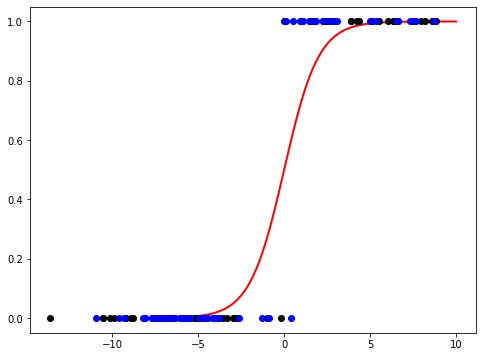
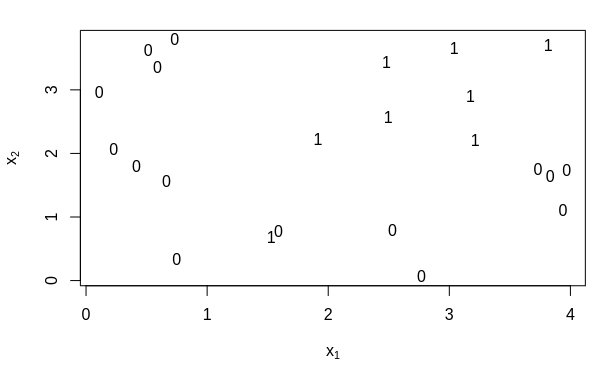
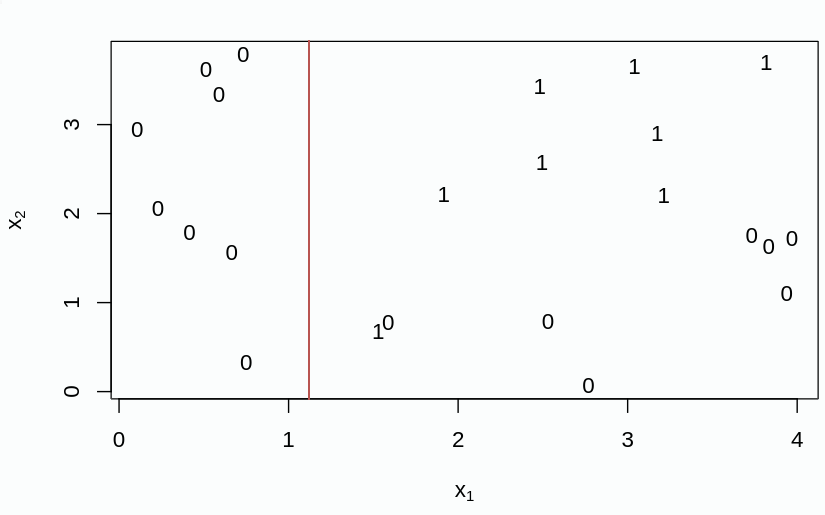
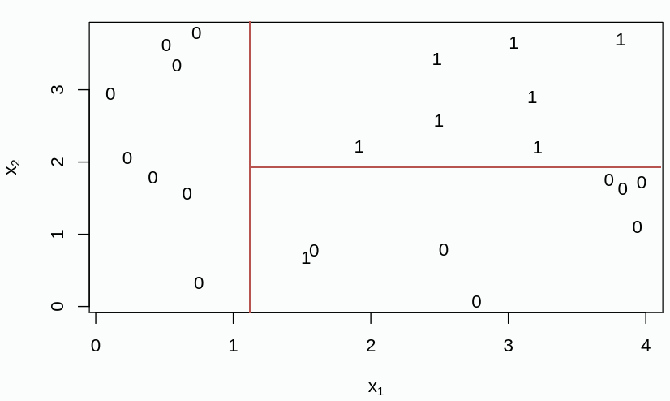
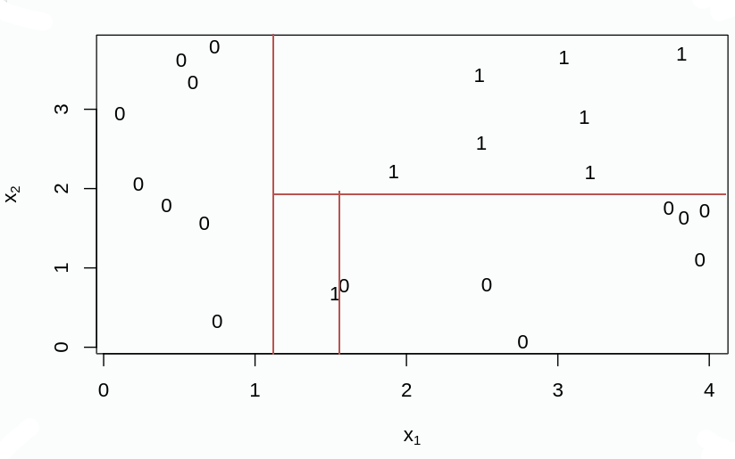
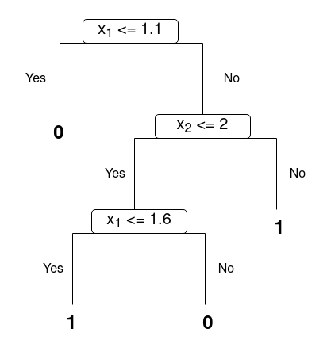

## Problem 8

### Task a

The means and the standard deviations for each of the attributes can be easily calculated using embedded function; for instance, I used the `mean()` and `std()` functions from `pandas`. First of all, I separated the training set into two different dataframes (each one containing only one category, `Adelie` or `notAdelie`), and then I applied the functions on each column. The results are reported in the following tables:

#### Class `Adelie`

|  | **bill_length_mm** | **bill_depth_mm** | **flipper_length_mm** | **body_mass_g** |
|---|---|---|---|---|
| **Mean** | 38.12 | 18.34 | 188.88 | 3576.0 |
| **STD** | 2.78 | 1.20 | 6.32 | 461.34 |

#### Class `notAdelie`

|  | **bill_length_mm** | **bill_depth_mm** | **flipper_length_mm** | **body_mass_g** |
|---|---|---|---|---|
| **Mean** | 47.82 | 15.89 | 211.3 | 4657.0 |
| **STD** | 3.60 | 1.97 | 11.79 | 787.53 |

The prior probability for the classes, using Laplace smoothing, can be easily calculated using the following formula: $$\hat{P}(Y=y)=\frac{m+\sum_{i=1}^{n}I(y_i=y)}{2m+n}$$ where $I(y_i=y)=1$ when $y_i=y$ and $0$ otherwise, and $m$ is the pseudocount for the Laplace smoothing (in this case, it is $1$). I applied the formula for both the classes and I got the following results:

- For class `Adelie`, $P=0.3377$
- For class `notAdelie`, $P=0.6623$

### Task b

The posterior probability for Naïve Bayes for this problem is (for brevity $A$ represents Y="Adelie" and $N$ represents Y="notAdelie"): $$P(A\ |\ \bold{x}) = \frac{P(A)\cdot \prod_{i=1}^{4}P(x_i\ |\ A)}{P(A)\cdot \prod_{i=1}^{4}P(x_i\ |\ A) + P(N)\cdot \prod_{i=1}^{4}P(x_i\ |\ N) }$$

This is simply calculated from the Bayes theorem where $\bold{x}$ is not a scalar value but a vector of features. 
In the formula above, $P(A)$ and $P(N)$ are the prior probabilities calculated in the previous task. According to NB assumption the ddimensions are independent, and hence we can represent the class-specific probabilities (the terms of the productories in the formula above) as 1-dimensional normal distribution. In mathematical terms: $$P(x_i\ |\ A) = k \sim N(\mu_i, \sigma_i^2)$$ where $\mu_i$ and $\sigma_i$ are, respectively, the mean and the standard deviation of the feature $x_i$ (I calculated them in the previous task). The final formula is then the first formula with elements drawn from the normal distributions instead of the conditional probabilities.

### Task c

I used the formula I got in the previous task to predict the classes on the test set and therefore calculate the accuracy of the model.
First of all, I computed the normal distribution for each of the features for both the classes `Adelie` and `notAdelie` with `scipy`:

```python
norm_x1_a = scipy.stats.norm(mean_x1_a, std_x1_a)
```

This instruction returns the normal distribution for feature $x_1$, _i.e._ `bill_length_mm` (I did the same for every feature both for class `Adelie` and `notAdelie`). Trivially, `mean_x1_a` and `std_x1_a` are the mean and the standard deviation for feature $x_1$.
Then, I wrote a simple function that predicts the class on a single row:

```python
def classify(row):
    P = prior_adelie*
        norm_x1_a.pdf(row['bill_length_mm']) *
        norm_x2_a.pdf(row['bill_depth_mm']) *
        norm_x3_a.pdf(row['flipper_length_mm']) *
        norm_x4_a.pdf(row['body_mass_g'])
    P = P/(
        P + 
        prior_notadelie * 
        norm_x1_na.pdf(row['bill_length_mm']) *
        norm_x2_na.pdf(row['bill_depth_mm']) *
        norm_x3_na.pdf(row['flipper_length_mm']) *
        norm_x4_na.pdf(row['body_mass_g']))
    if P >= 0.5:
        return 'Adelie'
    else:
        return 'notAdelie'
```

Where `prior_adelie` and `prior_notadelie` are the prior probabilities of, respectively, `Adelie` and `notAdelie` (calculated in Task a); `pdf` is the method that returns the probability density function.

Finally, I calculated the accuracy of the classifier simply counting the number of "right" answers, iterating on the rows of the test set, and dividing it for the number of total samples of the test set:

```python
right = 0
for row in test_data.iterrows():
    res = classify(row[1])
    if res == row[1]['species']:
        right+=1
accuracy = right/len(test_data)
```

With this classifier, I got an accuracy score of 0.92, _i.e._ 92%.

## Problem 9

For this task I used Python with `scikit-learn` library for Logistic Regression. First of all, I loaded the two datasets (train and test) into two different Pandas DataFrames; then, I created the model and I fitted it with $x=(x_1, x_2, x_3, x_4)^T$ features (_i.e._ the four features of the dataset) and $y$ the class (`Adelie` or `notAdelie`) suitably converted into 1 for `Adelie` class and 0 for `notAdelie` class.

### Task a

The model coefficients I got are the following:

- $\beta$ = (1.57894316, -0.979289548e,  0.00101773624,  0.0510530046)
- intercept = 0.0364156

I got accuracy equal to $1.0 = 100%$ on the training set and equal to $0.987 = 98.7%$ on the test set.

In order to plot the datapoints and the curve, since `scikit-learn` does not have a function to plot linear responses with multiple feature (in this case we have four features), I wrote a simple function that calculated the linear reponse given the data, the coefficients and the intercept term:

```python
def calculate_x(coef, intercept, x):
    toret = []
    for _, row in x.iterrows():
        t = coef[0]*row['bill_depth_mm'] +
            coef[1]*row['bill_length_mm'] +
            coef[2]*row['body_mass_g'] +
            coef[3]*row['flipper_length_mm'] +
            intercept
        toret.append(t)
    return toret
```

Then, I plotted the datapoints for the training set (black) and for the test set (blue), and the logistic function.

{width=260px}

As the reader can notice, the graph is in line with the computed model accuracy.

Finally, the exercise asked to report the linear response for a particular penguin; this value can be easily calculated with the function I reported above. For instance, penguin number 10 in the training set has the following feature values:

- `bill_depth_mm` = $16.6$
- `bill_length_mm` = $36.5$
- `body_mass_g` = $2850.0$
- `flipper_length_mm` = $181.0$

And its linear response is $2.644$.

### Task b

I did not experience this problem; nevertheless, googling around for this warning I discovered that it could happen when in the model there are too many variables, and this leads to a perfect separation of cases (and this is overfitting). 
In this case, the model likelihood is not defined (if we watch the logistic function we would probably see a step function), and then it is impossible to get the model to converge.
Some solutions to this problem could be:

- Reducing the features, for example with backward or forward feature selection;
- Removing outliers from the data;
- Increasing the data sample size, if this is possible (in this case, maybe, we could use train+test sets together, even if this is not a good idea since we could no more calculate the accuracy on the test set).

### Task c

The most important difference between generative and discriminative classifiers is that a generative classifier model the distribution of individual classes, while a discriminative classifier learn the boundaries between classes. Mathematically speaking, the formers build a model for the whole joint distribution $P(x,y)$ (often, but not always, using the marginal probability decomposition, _i.e._ $P(x,y)=P(y)P(x|y)$, as wee see it in the Bayes theorem), while the latter directly models the probability $P(y|x)$, that is the class distribution.

(Some) pros and cons are listed in the next table.

|  | **Pros** | **Cons** |
|---|---|---|
| **Discriminative** | Often better accuracy | Only solve task you need to solve, _i.e._ is less flexible Optimization is harder |
| **Generative** | - Handles missing data more naturally - Optimization is easier - Easier to detect distribution changes  | Worse accuracy, since is a more flexible model |

For this particular dataset, we could have used both a discriminative model (like we did, since we used logistic regression) and a generative model; this last one, in fact, expects an assumption to be made, that is that the features are independent between them. It's not totally true that in this datasets the features are independent, but it has been shown that generative models like Naïve Bayes actually works good also with somewhat-dependent features.

## Problem 10

### Task a

According to the authors, it's not really clear-cut which of the models, discriminative or generative, is the best. They claim that most of the people think that discriminative is usually better than generative learning, but in this paper they analyzed some aspects of both (Logistic Regression vs Naïve Bayes) and assert that: 

- The generative model (NB) has a higher asymptotic error than the discriminative model (logistic regression) as the number of training samples becomes large (and therefore, in this case, the discriminative model is better)
- _"As the number of training samples is increased, there can be two distinct regimes of performance, the first in which the generative model has already approached its asymptotic error and is thus doing better, and the second in which the discriminative model approaches its lower asymptotic error and does better"_, _i.e._ when a generative model has already reached its asymptotic error it usually performs better.

### Task b

$h_{Gen}$ is a model chosen by optimizing the joint likelihood of the inputs and the labels, while $h_{Dis}$ is a model chosen or by optimizing the conditional likelihood (_i.e._ $P(y|x)$) or minimizing the 0-1 training error obtained by thresholding $P(y|x)$. In other words, $h_{Gen}$ is a generative model and $h_{Dis}$ is a discriminative model, and they are chosen in such a way that they are at the best of their usage (the best condition).

In the paper the authors compare, as just said, a generative model and a discriminative model, and to be more precise they compare Naïve Bayes classification and Logistic Regression classification, and they call it a _Generative-Discriminative pair_.

### Task c

The graphs report the relation between $m$, that is the the number of independent and identically distributed random samples, and the generalization error for both Naïve Bayes and Logistic Regression. From the graphs we can easily see that there's not a model that *always* performs better than the other: in fact, for most of the analyzed variables NB performs better than Logistic Regression, since the error is smaller; for some other variables, though, for instance `liver disorders` and `lenses`, Logistic Regression regression starts performing better from a certain high $m$. This is in line with what the authors stated in the introduction.

## Problem 11

## Problem 12

For this task I decided to study equation (8.5), _i.e._ classification error rate, that is defined as $$E = 1 − max_{k}(\hat{p}_{mk})$$

### Task a

Note: the decision tree is reported at the end of this section.
First of all, we have this.

{width=300px}

In this space we have 15 zeros and 8 ones, with a total of 23 elements. The initial classification error rate is then $$E_{orig} = 1 - max(\frac{15}{23}; \frac{8}{23})$$ and therefore $E_{orig} = \frac{8}{23}$.

Then, we have to split the data in a way that minimizes the error rate; since it's difficult to calculate every error rate, I divided it in the way that seemed to be the best (as also said in the exercise text) and I calculated the error a posteriori (even if the algorithm does the inverse); I obtained this partition:

{width=300px}

Here the error rate is $$E_{part1} = 1 - max(\frac{8}{15}; \frac{7}{15}) = \frac{7}{15}$

Then, we repeat the procedure with another partition:

{width=300px}

And another one: 

{width=300px}

In the end, we get error rate equals to 0, since there are no partitions with different elements.
The decision tree of this procedure is the following:

{width=300px}