# Problem 16

## Task a

We can use k-means algorithm in order to find a clustering, _i.e._ a partition, of data points such that points in the same cluster are similar. The basic idea of k-means is that, given an integer k (the number of clusters), we have to find a set of centroids $\mu_i\in\mathbb{R}^p$ such that the following loss function is minimised: $$L_{kmeans}=\sum_{i=1}^{n}\parallel x_i-\mu_{j(i)}\parallel_2^2$$
Obviously, the task to find the right centroids (_i.e._ the optimisation problem) is NP-hard, since one should try every possible combination; therefore, it's usually impossible to solve k-means exactly in practice.
Then, usually we use some heuristic algorithm, that may end up in local minimum; Lloyd's algorithm is one of them.
The basic idea of Lloyd's algorithm is to first assign data points to random clusters, and then to alternate setting each cluster centroid to average of the points in the cluster and assign each data point to the closest centroid, until convergence.
The **inputs** of the algorithm are then the data points in the space and the number of clusters to which assign the points; the **output** of the algorithm is the clustering, _i.e._ the partition of the space into k clusters.
The results can be interpreted like an approximation of the exact clustering since this procedure, as just said, is an heuristic for k-means exact algorithm.

## Task b

The cost function that Lloyd's algorithm tries to minimize is the same of k-means, _i.e._ $$L_{kmeans}=\sum_{i=1}^{n}\parallel x_i-\mu_{j(i)}\parallel_2^2$$
During the two stages of each iteration we can prove that the loss function cannot increase; in fact:

- When we assign the point _i_ to the closest centroid we are minimizing $\parallel x_i-\mu_{j(i)}\parallel_2^2$
- When we choose $\mu_j$ to be the mean of the points we are minimizing $\parallel x_i-\mu_{j}\parallel_2^2$

Moreover, the algorithm execution consists in a finite number of states and must stop after finite time. It is possible that it takes a long time to finish, but usually it finishes in a small amount of steps; in fact, it stops when the loss no longer changes (so when it finds a local minimum).

## Task c

First of all, the algorithm assign data points to random clusters; I decided to assign them to "non trivial" clusters in order to prove that the algorithm can converge also in this case. Note: the red points are cluster one, with centroid $\mu_1$ being the red cross, and the green one are cluster two with centroid $\mu_2$ being the green cross.
\newpage

{width=450px}

Then, the first iteration of the algorithm starts with the first step, that is setting every centroid to the average of the points in the cluster. Note: the average point $m$ between $n$ points can be easily calculated in the following way: $$x_m=\frac{1}{n}\sum_{i} x_i\ \ \ y_m=\frac{1}{n}\sum_{i} y_i$$
As the reader can see in the next image, the centroid $\mu_1$ is now positioned in $(2.5,2.5)$, since this is the average of $(0,1)$ and $(5,4)$, and the centroid $\mu_2$ is positioned in $(3.3,3.3)$, since this is the average of $(1,2)$, $(4,5)$ and $(5,4)$.

{width=450px}

After this step, the second step is performed: the points are assigned to the cluster of the nearest centroid. Note: the distance between two points (in this case between one point and its centroid) can be easily calculated with the euclidean distance, _i.e._ $$\sqrt{(x_1-x_2)^2 + (y_1-y_2)^2}$$ The clusters, then, become the followings:

{width=450px}

Then, the second iteration starts with the first step; the new centroids are now $\mu_1=(1.5,1.5)$ and $\mu_2=(4.6,4)$.

{width=450px}

Then the algorithm proceeds to the second step, that is the same of the last image since the points already belong to the right cluster.
With the start of the third iteration, the algorithm notices that the loss function does not decrease and then stops.

# Problem 17

## Task a

In order to sketch the hierarchical clustering I used the agglomerative approach. I started with the nearest two datapoints, then the second nearest datapoints and so on. The final dendrogram I achieved is this:
\newpage

{width=350px}

The following figure represents how the algorithm forms clusters step-by-step. The entire algorithm is drawn in the same image; the order of the cluster selections is represented by the red number near the cluster.

{width=400px}

The algorithm works as follows:

- In step 1, it chooses a clustering of `3` and `4`, with a joint cost of $1.36$;
- In step 2, it chooses a clustering of `6` and `7`, with a joint cost of $1.53$;
- In step 3, it chooses a clustering of `1` and `2`, with a joint cost of $2.24$;
- In step 4, it chooses a clustering of `5` and (`1`,`2`), with a joint cost of $2.35$, that is the distance between `2` and `5`;
- In step 5, it chooses a clustering of (`5`,(`1`,`2`)) and (`6`,`7`), with a joint cost of $2.42$, that is the distance between `5` and `6`;
- In step 6, it chooses the final clustering with a joint cost of $2.66$, that is the distance between `4` and `6`.

## Task b

I followed the same procedure of Task a, with the exception that I used complete linkage instead of sinlge linkage. The algorithm first finds the nearest couples of points, and then proceeds to create the clusters based on the maximum dissimilarity, _i.e._ the maximum distances between the clusters. The final dendogram I achieved is this:

{width=300px}

The following figure represents how the algorithm forms clusters step-by-step. The entire algorithm is drawn in the same image; the order of the cluster selections is represented by the red number near the cluster.

{width=400px}

The algorithm works as follows:

- In step 1, it chooses a clustering of `3` and `4`, with a joint cost of $1.36$;
- In step 2, it chooses a clustering of `6` and `7`, with a joint cost of $1.53$;
- In step 3, it chooses a clustering of `1` and `2`, with a joint cost of $2.24$;
- In step 4, it chooses a clustering of `5` and (`3`,`4`), with a joint cost of $3.28$, that is the distance between `4` and `5`;
- In step 5, it chooses a clustering of (`5`,(`3`,`4`)) and (`6`,`7`), with a joint cost of $4.79$, that is the distance between `3` and `7`;
- In step 6, it chooses the final clustering with a joint cost of $8.04$, that is the distance between `1` and `7`.

# Problem 18

## Task a

After having opportunely pre-processed the data, I tried first to cluster the rows of the original data matrix, _i.e._ without any column normalization. The results I got were in line with what I expected: the loss were very high for every number of clusters, but it went down with a larger number of clusters.
After this, I did the same with the normalized data, and I plotted the curves for both the cases; in order to do that I used `sklearn` with the following code:

```python
scaled = preprocessing.scale(
  training_set[training_set.columns.difference(['class4'])]
  )
for i in range(1, 21):
    km = KMeans(n_clusters=i).fit(
      training_set[training_set.columns.difference(['class4'])]
      )
    toplotY_un.append(
      -1*km.score(
        training_set[training_set.columns.difference(['class4'])]
        )
      )
    toplotX_un.append(str(i))

    km = KMeans(n_clusters=i).fit(scaled)
    toplotY_sc.append(-1*km.score(scaled))
    toplotX_sc.append(str(i))
```

The plot with both cureves is the following:

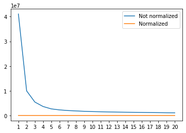{width=320px}

The normalization had a huge effect on the result: the loss has, in fact, more or less the same value for every cluster. However, from the graph above it is not clear that the loss is actually different with different numbers of clusters (due to the fact that the highest losses for non-normalized data are really larger). For the sake of clarity, I am also reporting the losses for normalized data:

| Number of clusters | Loss | | Number of clusters | Loss |
|---|---|---|---|---|
| 1 | 22899.999999999993 |  | 11 | 7329.800582322089 |
| 2 | 15869.168844721906 |  | 12 | 7044.47080452127 |
| 3 | 13147.730831928027 |  | 13 | 6792.264272305343 |
| 4 | 10845.54542406677 | | 14 | 6661.316485423587 |
| 5 | 9721.85276196181 |  | 15 | 6434.96222248738 |
| 6 | 9114.481702253473 | | 16 | 6229.296165524172 |
| 7 | 8710.037463131892 | | 17 | 6154.216707369852 |
| 8 | 8267.927506498807 | | 18 | 6080.210374598219 |
| 9 | 7896.641887813164 | | 19 | 5832.040716217323 |
| 10 | 7608.535772259967 |  | 20 | 5701.86207865343 |

## Task b

I used the scaled variables to build a k-means clustering with `sklearn` with the following code:

```python
km = KMeans(n_clusters=4).fit(scaled)
```

Then I plotted the confusion matrix with the predicted values in function of the actual cluster and I reordered them as asked in order to maximize the sum on the left-to-right diagonal; the final result I got is this:

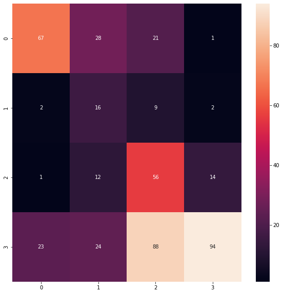{width=350px}

From this matrix it's pretty clear that the most errors happen were the values outside the diagonal are higher. This is particularly true for the last row, _i.e._ for the fourth class (`II` in this dataset): the first, second and third values are in fact wrong "predictions" with a really high count.

## Task c

For this task I repeated the code of the task above for 1000 times; since I was using `sklearn`, I used the `init=random` flag in the KMeans constructor. For each execution I saved the loss, and for the entire execution I found the minimum and the maximum losses. The resulting histogram I got is the following: 

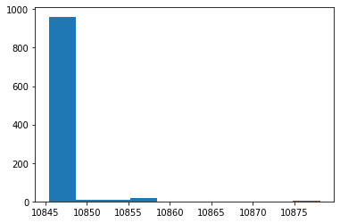{width=350px}

The minimum loss I got was $10845.407939650557$, and the maximum $10878.13091095091$. Since the minimum and the maximum are really near and the loss is the minimum for most of the repetitions, it is not that difficult to find an optimal result: only a few executions should work.

I did not try with a smart initializations due to my really not powerful laptop (it was in fact taking really too long to execute). However, with a smarter initialization I would expect to have even more occurrencies with the smallest loss.

## Task d

I tried clustering the data with agglomerative hierarchical clustering. I tried both with complete linkage and single linkage, and I plotted the dendrograms using the [this function from Sklearn (click)](https://scikit-learn.org/stable/auto_examples/cluster/plot_agglomerative_dendrogram.html). The dendrogram for the clustering with complete linkage I got is the following:

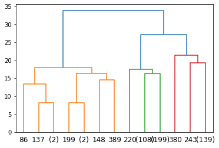{width=300px}

The dendrogram for the clustering with single linkage I got is the following:

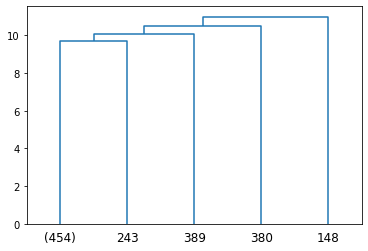{width=300px}

Both the agglomerative clusterings I performed turned out to be binary clusterings, _i.e._ the number of clusters was two for both. This was probably due to the standard implementation of `AgglomerativeClustering` class from `sklearn`, and I noticed it from the confusion matrices I plotted initially: most of the samples were, in fact, in cluster 0, while only some of them were in in cluster 1 (and there were no samples in the other two clusters). Consequently, I tried forcing the number of clusters putting `n_clusters=4` as a hyperparameter to the AgglomerativeClustering constructor. The results I got made a lot more sense; these are reported below as confusion matrices.

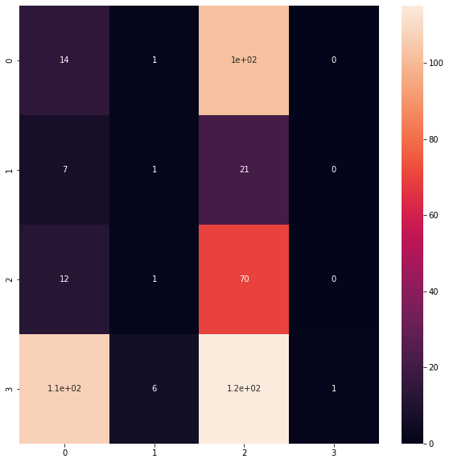{width=320px}

\newpage

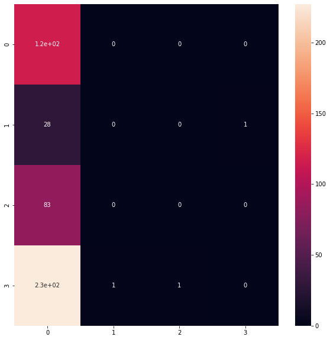{width=320px}

# Problem 19

## Task a

First of all, as always a pre-processed a little the data and I scaled the entire dataset using `sklearn`'s `StandardScaler`. Then I decided to plot the PCA as a biplot using the following function, that is a slight modification of [this function on stackoverflow (click)](https://stackoverflow.com/questions/39216897/plot-pca-loadings-and-loading-in-biplot-in-sklearn-like-rs-autoplot):

```python
def biplot(score,coeff,labels=None):
    xs = score[:,0]
    ys = score[:,1]
    n = coeff.shape[0]
    scalex = 1.0/(xs.max() - xs.min())
    scaley = 1.0/(ys.max() - ys.min())
    plt.scatter(xs * scalex,ys * scaley, c = y, s=5)
    for i in range(n):
        plt.arrow(0, 0, coeff[i,0], coeff[i,1],color = 'r',alpha = 0.5)
        if labels is None:
            plt.text(
              coeff[i,0]* 1.15, 
              coeff[i,1] * 1.15, 
              "Var"+str(i+1), 
              color = 'g', 
              ha = 'center', 
              va = 'center'
              )
        else:
            plt.text(
              coeff[i,0]* 1.15,
              coeff[i,1] * 1.15, 
              labels[i], 
              color = 'g', 
              ha = 'center', 
              va = 'center'
              )
    plt.xlim(-0.5,0.75)
    plt.ylim(-.75,.75)
    plt.xlabel("PC{}".format(1))
    plt.ylabel("PC{}".format(2))
    plt.grid()
```

The result I got is the following; note: purple points are `nonevent`, green are `Ia`, yellow are `Ib` and blue are `II`: 

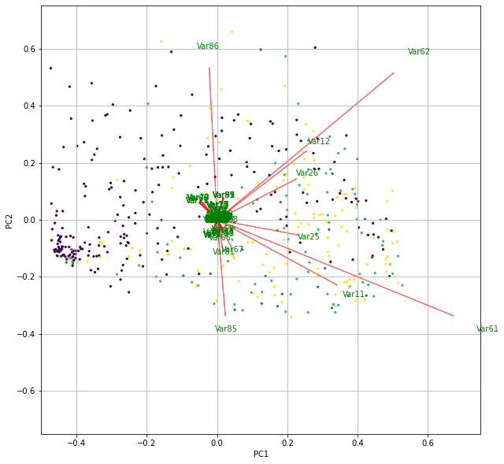{width=400px}

## Task b

In order to plot both the percentage and the cumulative percentage of variance explained I used `sklearn`'s `PCA` attributes; the following code calculates the percentages from the first to the tenth point (including other points would have been useless since the percentage of variance explained of them is zero):

```python
x = []
y_down = []
y_up = []
sum = 0

pca = model.fit(X)

for i in range(10):
    x.append(str(i+1))
    y_down.append(pca.explained_variance_ratio_[i])
    sum += pca.explained_variance_ratio_[i]
    y_up.append(sum)
```

Plotting the points I got the following result:

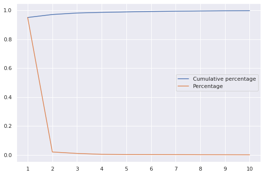{width=350px}

Then I repeated the same but with the data scaled to zero mean and unit variance; in order to scaled the data I used the following code:

```python
x_scaled = preprocessing.scale(X)
```

with `preprocessing` being a `sklearn` in-built function. The result I got was the following (both the percentages are calculated on the first 30 points for the same reason as before):

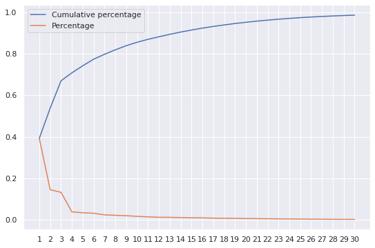{width=350px}

As expected, both curves change differently in the two scenarios: for unscaled data, most of the variance is explained by the first **2/3 features**; for unscaled data, on the other hand, almost the whole variance is explained by the first **30 features**. The reason for this phenomenon is that the first variables, as they are represented in the dataset, have a high variance; hence, it is trivial that the biggest part of variance is explained by them. After the scaling to zero mean and unit variance, the variance explained by them naturally decreased because they are, in fact, scaled.

## Task c

For this task I used a simple Logistic Regression from `sklearn`, with only one different hyperparameter, that is `max_iter=1000` in order to not make the model reach the maximum number of iterations. As performance metric I decided to use binary accuracy score.
Without any PCA I got an accuracy of $0.813$; then, I tried performing PCA with different number of components (`n_components`), from 1 to 100. In order to perform PCA, I first scaled the data to zero mean and unit variance as I did before; in order to see the effect of the feature reduction, I decided to plot the accuracy in function with the number of components. The result I got is the following:

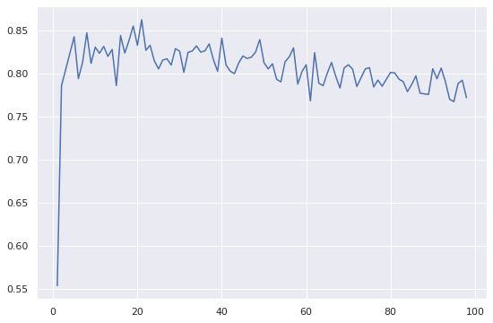{width=350px}

Both from this graph and for the additional code I wrote to get the best number of components, it is pretty clear that the accuracy can be higher with less features, and indeed it is so: I got the best accuracy, that is $0.859$ with $21$ features.

# Problem 20

From this exercise set and from the course in general I received a good overview of unsupervised learning, in particular clustering and hierarchical clustering; of these topics I found also interesting to study different algorithms, such as Lloyd's algorithm's vs plain k-means algorithm and the different linkage methods for hierarchical clustering.

I also learned dimensionality reduction techniques that are actually used in a production environment, such as PCA; this was also particularly useful for the term project.

This time I think I understood correctly all the topics of this section; however, I still have some problems with "putting into code" some ideas I have.

As for the other sections of this course, I think everything we have done is a good overview of machine learning and its typical techniques, then I think that everything is relevant for other studies and future work.