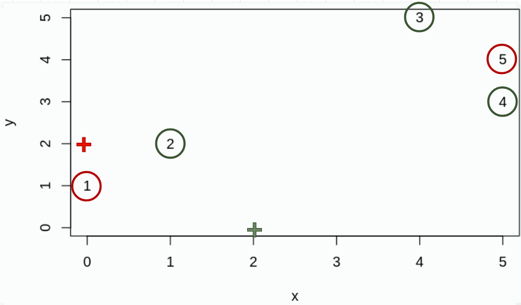
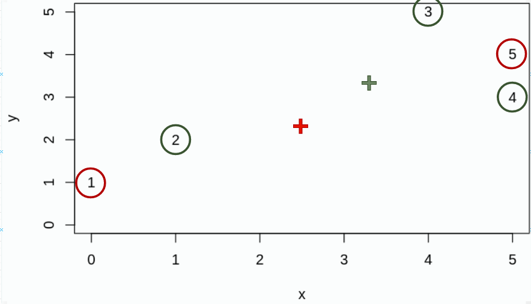
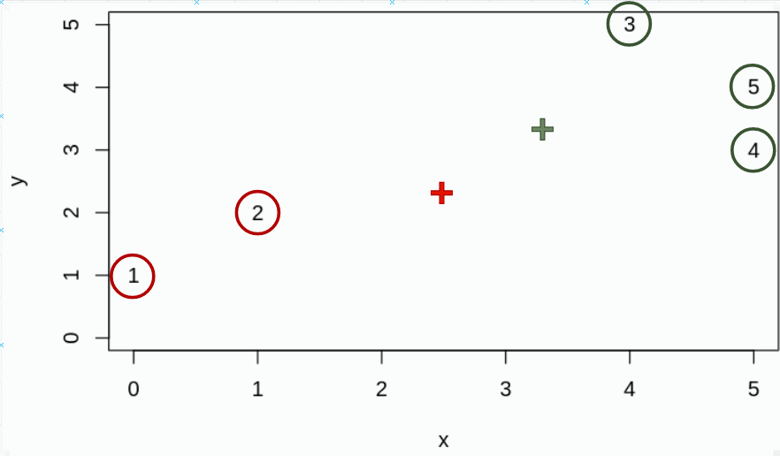
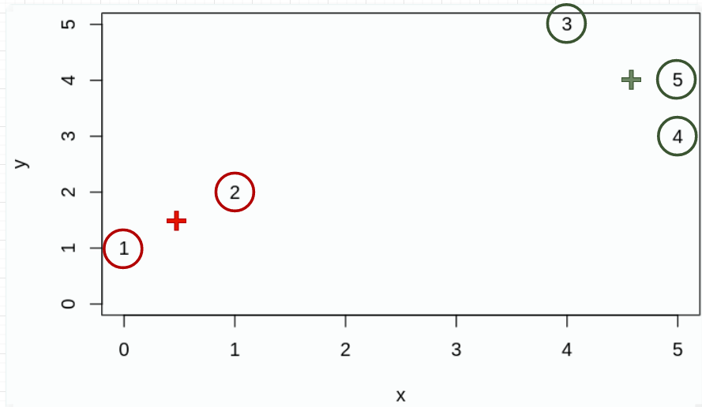
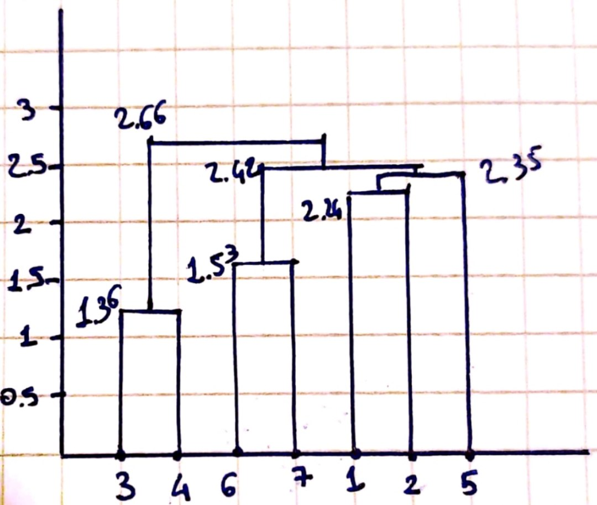
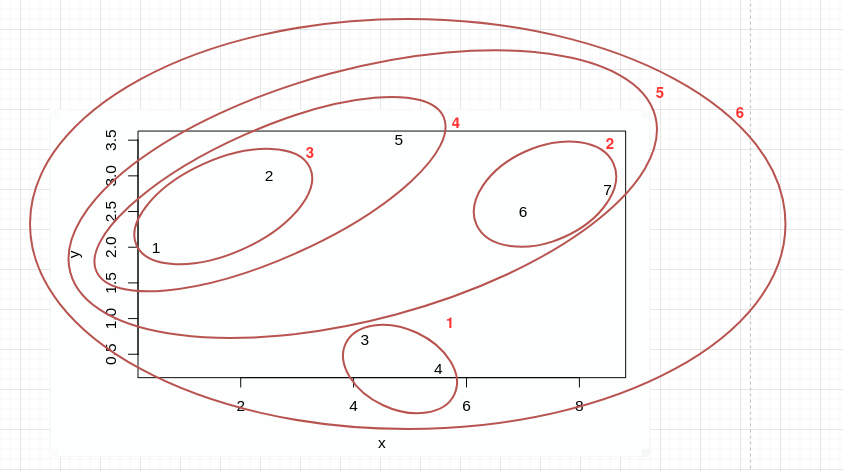
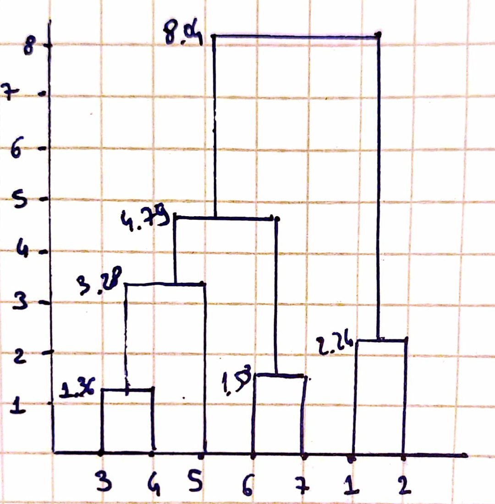
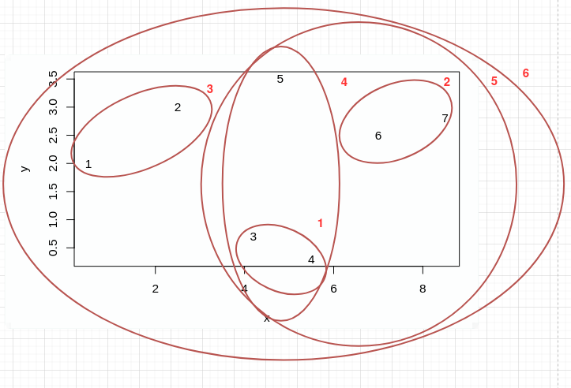

# Problem 16

## Task a

We can use k-means algorithm in order to find a clustering, _i.e._ a partition, of data points such that points in the same cluster are similar. The basic idea of k-means is that, given an integer k (the number of clusters), we have to find a set of centroids $\mu_i\in\mathbb{R}^p$ such that the following loss function is minimised: $$L_{kmeans}=\sum_{i=1}^{n}\parallel x_i-\mu_{j(i)}\parallel_2^2$$
Obviously, the task to find the right centroids (_i.e._ the optimisation problem) is NP-hard, since one should try every possible combination; therefore, it's usually impossible to solve k-means exactly in practice.
Then, usually we use some heuristic algorithm, that may end up in local minimum; Lloyd's algorithm is one of them.
The basic idea of Lloyd's algorithm is to first assign data points to random clusters, and then to alternate setting each cluster centroid to average of the points in the cluster and assign each data point to the closest centroid, until convergence.
The **inputs** of the algorithm are then the data points in the space and the number of clusters to which assign the points; the **output** of the algorithm is the clustering, _i.e._ the partition of the space into k clusters.
The results can be interpreted like an approximation of the exact clustering since this procedure, as just said, is an heuristic for k-means exact algorithm.

## Task b

The cost function that Lloyd's algorithm tries to minimize is the same of k-means, _i.e._ $$L_{kmeans}=\sum_{i=1}^{n}\parallel x_i-\mu_{j(i)}\parallel_2^2$$
During the two stages of each iteration we can prove that the loss function cannot increase; in fact:

- When we assign the point _i_ to the closest centroid we are minimizing $\parallel x_i-\mu_{j(i)}\parallel_2^2$
- When we choose $\mu_j$ to be the mean of the points we are minimizing $\parallel x_i-\mu_{j}\parallel_2^2$

Moreover, the algorithm execution consists in a finite number of states and must stop after finite time. It is possible that it takes a long time to finish, but usually it finishes in a small amount of steps; in fact, it stops when the loss no longer changes (so when it finds a local minimum).

## Task c

First of all, the algorithm assign data points to random clusters; I decided to assign them to "non trivial" clusters in order to prove that the algorithm can converge also in this case. Note: the red points are cluster one, with centroid $\mu_1$ being the red cross, and the green one are cluster two with centroid $\mu_2$ being the green cross.
\newpage

{width=450px}

Then, the first iteration of the algorithm starts with the first step, that is setting every centroid to the average of the points in the cluster. Note: the average point $m$ between $n$ points can be easily calculated in the following way: $$x_m=\frac{1}{n}\sum_{i} x_i\ \ \ y_m=\frac{1}{n}\sum_{i} y_i$$
As the reader can see in the next image, the centroid $\mu_1$ is now positioned in $(2.5,2.5)$, since this is the average of $(0,1)$ and $(5,4)$, and the centroid $\mu_2$ is positioned in $(3.3,3.3)$, since this is the average of $(1,2)$, $(4,5)$ and $(5,4)$.

{width=450px}

After this step, the second step is performed: the points are assigned to the cluster of the nearest centroid. Note: the distance between two points (in this case between one point and its centroid) can be easily calculated with the euclidean distance, _i.e._ $$\sqrt{(x_1-x_2)^2 + (y_1-y_2)^2}$$ The clusters, then, become the followings:

{width=450px}

Then, the second iteration starts with the first step; the new centroids are now $\mu_1=(1.5,1.5)$ and $\mu_2=(4.6,4)$.

{width=450px}

Then the algorithm proceeds to the second step, that is the same of the last image since the points already belong to the right cluster.
With the start of the third iteration, the algorithm notices that the loss function does not decrease and then stops.

# Problem 17

## Task a

In order to sketch the hierarchical clustering I used the agglomerative approach. I started with the nearest two datapoints, then the second nearest datapoints and so on. The final dendrogram I achieved is this:
\newpage

{width=350px}

The following figure represents how the algorithm forms clusters step-by-step. The entire algorithm is drawn in the same image; the order of the cluster selections is represented by the red number near the cluster.

{width=400px}

The algorithm works as follows:

- In step 1, it chooses a clustering of `3` and `4`, with a joint cost of $1.36$;
- In step 2, it chooses a clustering of `6` and `7`, with a joint cost of $1.53$;
- In step 3, it chooses a clustering of `1` and `2`, with a joint cost of $2.24$;
- In step 4, it chooses a clustering of `5` and (`1`,`2`), with a joint cost of $2.35$, that is the distance between `2` and `5`;
- In step 5, it chooses a clustering of (`5`,(`1`,`2`)) and (`6`,`7`), with a joint cost of $2.42$, that is the distance between `5` and `6`;
- In step 6, it chooses the final clustering with a joint cost of $2.66$, that is the distance between `4` and `6`.

## Task b

I followed the same procedure of Task a, with the exception that I used complete linkage instead of sinlge linkage. The algorithm first finds the nearest couples of points, and then proceeds to create the clusters based on the maximum dissimilarity, _i.e._ the maximum distances between the clusters. The final dendogram I achieved is this:

{width=300px}

The following figure represents how the algorithm forms clusters step-by-step. The entire algorithm is drawn in the same image; the order of the cluster selections is represented by the red number near the cluster.

{width=400px}

The algorithm works as follows:

- In step 1, it chooses a clustering of `3` and `4`, with a joint cost of $1.36$;
- In step 2, it chooses a clustering of `6` and `7`, with a joint cost of $1.53$;
- In step 3, it chooses a clustering of `1` and `2`, with a joint cost of $2.24$;
- In step 4, it chooses a clustering of `5` and (`3`,`4`), with a joint cost of $3.28$, that is the distance between `4` and `5`;
- In step 5, it chooses a clustering of (`5`,(`3`,`4`)) and (`6`,`7`), with a joint cost of $4.79$, that is the distance between `3` and `7`;
- In step 6, it chooses the final clustering with a joint cost of $8.04$, that is the distance between `1` and `7`.